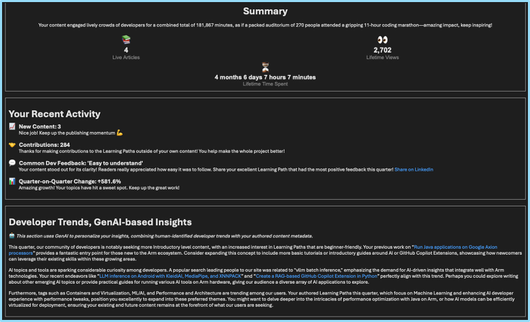

## Challenge

Technical blog authors spend hours creating tutorials, but rarely get visibility into what is popular and who is reading their work. For Arm Learning Paths, if contributors knew what topics they could write in their skill set that addresses developer needs it would lead to a win-win-win-win:
- **Contributors** get further reach and establish themselves as subject matter experts in popular domains.
- **Readers** learn to solve their pressing problems.
- **Learning Paths** attract more readers.
- **Arm** ecosystem becomes stronger.

The Arm Learning Path site collects usage data like other blogging sites and can send automated emails with generalized insights into what is popular. Matching those generalized insights with actionable advice tailored to each author's skill set, however, has previously been prohibitively time consuming.

## Solution

An AI tool that generates quarterly emails for each contributor, full of insights and personalized tips to write more successful Learning Paths. The AI does this by combining site-level analytics, market trends, and popular Google searches with the skill set and experience of each author.

## AI developer tools used

- ChatGPT

## Results

Quarterly emails are now being sent (was previously a 'nice-to-have' but always below the line). GitHub Copilot Agent-mode was used to generate the email code, ~1,000 lines, and ChatGPT-4o is used dynamically to generate contributor-specific insights.

The first emails have been sent for feedback, and will start sending to all contributors in Q2. Feedback and affect on contributions will be measured to quantify impact.

