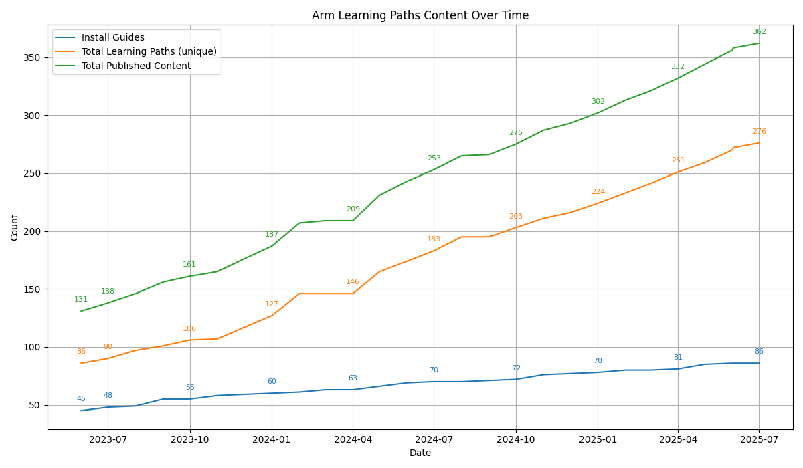

## Challenge

Automating reporting to cover the Learning Path roadmap, published content, and additional metrics is valuable but time consuming. Various methods have been tried which balance the time it takes to record what is happening and generating useful metrics from the data. Ideally, metrics can be generated automatically using a lightweight workflow to add topics to the roadmap, receive new pull requests, review, and publish. 

Extra requirements often come up to keep track of the number of Learning Paths related to Arm Cloud Migration or a partner like Hugging Face. 

## Solution

The [roadmap](https://github.com/ArmDeveloperEcosystem/roadmap) GitHub repository and the [Learning Path](https://github.com/orgs/ArmDeveloperEcosystem/projects/4) GitHub project were created to help make the publishing faster and better keep track of important metrics. 

AI developer tools were used to create required scripts and GitHub Actions workflows to generate the required data, summarize content, and measure the throughput of the Learning Path team. 

## AI developer tools used

- Amazon Q CLI
- GitHub Copilot

## Results

Writing code to mine the Learning Path repository is useful, but was not a priority because it always falls in the nice-to-have category. With AI tools, the task to create Python and bash scripts drops from days to hours or minutes and suddenly it's worth the effort. The project has about 1000 lines of code, all generated.

A number of scripts are now available in the roadmap repository which were all created by GitHub Copilot and Amazon Q CLI. 

The measure and record:
- Content published for a single month
- Content published for a group of months, such as a quarter or a year
- Learning Paths associated with Hugging Face and Arm Cloud Migration
- Growth of content quantity over time
- Metrics for when the Learning Path team received a new pull request until it was published

With his information anyone can see what has been published recently and self-serve vs. asking, "what are you going to publish next?" and "what did you publish last month?". 

Below is a picture of the content growth over time generated by AI developer tools.

