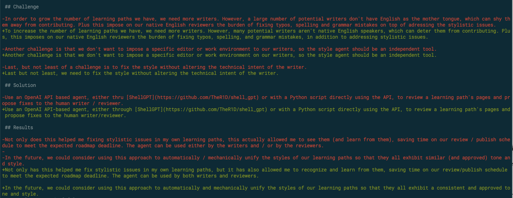

## Challenge

To increase the number of learning paths we have, we need more writers. However, many potential writers aren't native English speakers, which can deter them from contributing. Plus, this imposes on our native English reviewers the burden of fixing typos, spelling, and grammar mistakes, in addition to addressing stylistic issues.

Another challenge is that we don't want to impose a specific editor or work environment on our writers, so the style agent should be an independent tool.

Last but not least, we need to fix the style without altering the technical intent of the writer.

## Solution

Use an OpenAI API-based agent, either through [ShellGPT](https://github.com/TheR1D/shell_gpt) or with a Python script directly using the API, to review a learning path's pages and propose fixes to the human writer/reviewer.

## AI developer tools used

- Shell GPT

## Results

Not only has this helped me fix stylistic issues in my own learning paths, but it has also allowed me to recognize and learn from them, saving time on our review/publish schedule to meet the expected roadmap deadline. The agent can be used by both writers and reviewers.

In the future, we could consider using this approach to automatically and mechanically unify the styles of our learning paths so that they all exhibit a consistent and approved tone and style.

Note that this card has been reviewed by the AI agent ! These are the fixes that were suggested at the time of writing:

