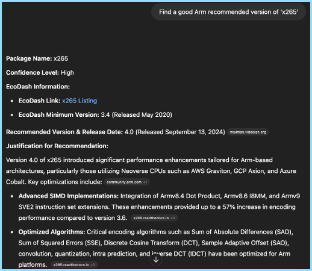

## Challenge

The [Arm Software Ecosystem Dashboard](https://www.arm.com/developer-hub/ecosystem-dashboard/) is already the single source of truth for developers to find the **minimum** versions of packages validated to run on Arm servers. But *minimum* ≠ *optimal*.  

Finding the *recommended* version (one that actually exploits Arm micro-architecture, compiler flags, and middleware upgrades) meant **digging through a maze of release notes and blog posts** and was so time-consuming it was never persued. However this information is highly valuable to developers, who often can't upgrade to the most recent version due to dependency conflicts but want a better experience over the minimum version supported.

## Solution

We built **RecommendedVersionGPT**, a custom GPT that takes in a package name and outputs a recommended version with a confidence level and justificaiton. It evaluates versions against four Arm-centric criteria to select the ideal case:

1. **Arm-specific optimizations** – Any additions of architecture features (NEON, SVE/SVE2), compiler flag optimizations, or Arm library usage.
2. **General System-level boosts** – Significant uplifts in performance, memory bandwidth, cache-aware fixes, or similar.
3. **First-class CI/CD support** - Addition of Arm builds into the project's CI/CD flow, indicating higher package quality.

Once the RecommendedVersionGPT provides a specific verison, we review for accuracy and do a quick pass to see if any other versions stand out on Google / StackOverflow. Once technical checks are complete, one click to create a PR adds the changes into the Ecosystem Dashboard.

## Results

This GPT is now actively used and has led to:

* **166 packages added recommended versions in 3 months** - A task previously deemed too time-consuming to take on.  
* **10× speed-up** - From an hour of detective work to a one-minute recommendation.  
* **Consistent, Arm-tuned guidance** - Devs no longer debate or guess; they ship faster, with higher performance.  

